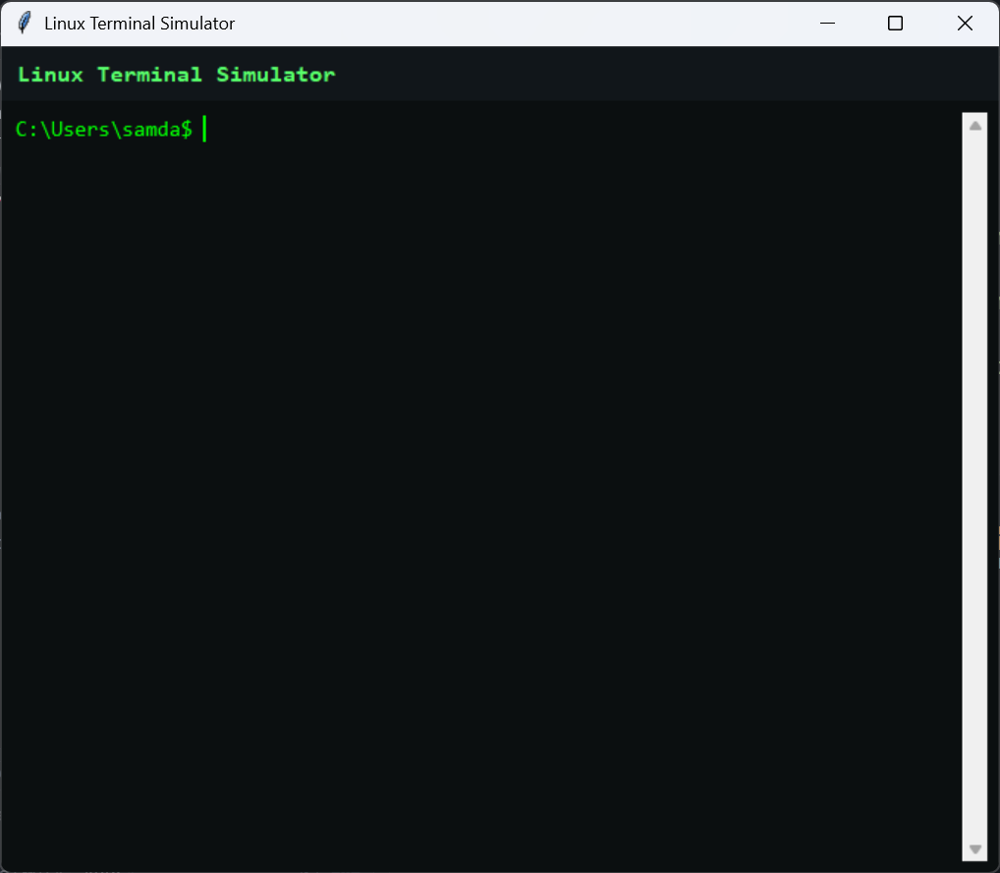
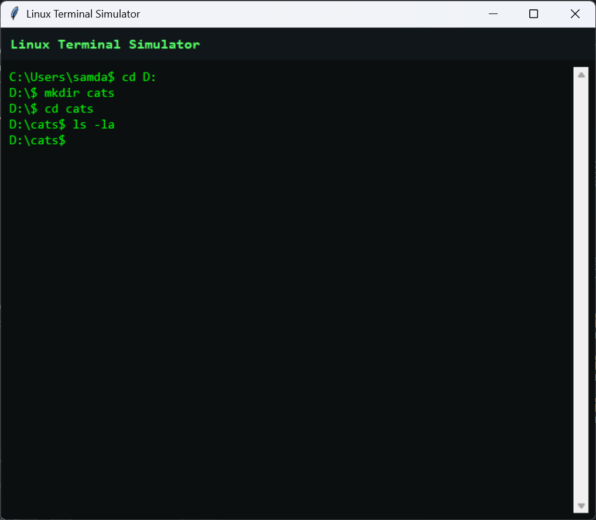
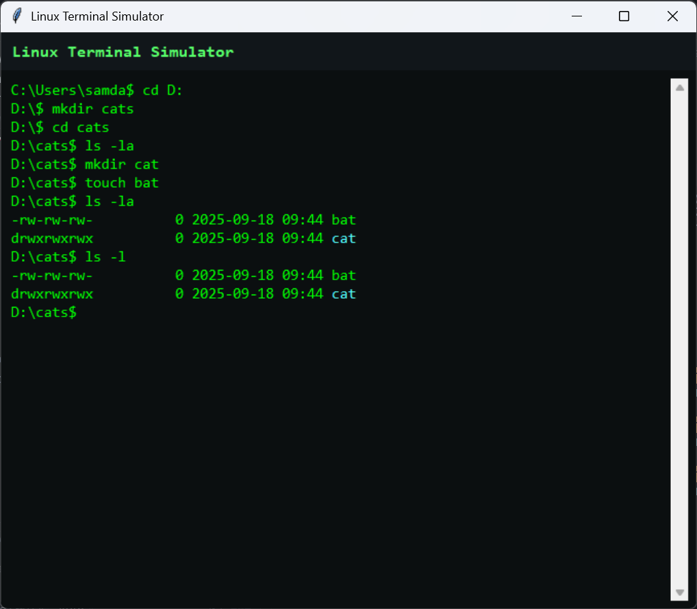

# Linux Terminal Simulator

A beautiful GUI-based Linux terminal simulator built with Python and Tkinter that provides an authentic command-line experience in a modern windowed interface.


## 📋 Table of Contents

- [Features](#-features)
- [Screenshots](#-screenshots)
- [Installation](#-installation)
- [Usage](#-usage)
- [Commands](#-commands)
- [Project Structure](#-project-structure)
- [Contributing](#-contributing)
- [License](#-license)
- [Author](#-author)

## ✨ Features

### 🖥️ **Professional Terminal Interface**
- **Console-style GUI**: Single text widget that acts as both output and input
- **Inline prompt**: Authentic terminal experience with cursor management
- **ANSI color support**: Beautiful syntax highlighting for directories and files
- **Cross-platform**: Works on Windows, macOS, and Linux

### 📁 **File System Operations**
- **Navigation**: `cd`, `pwd`, `ls` with color-coded output
- **File Management**: `touch`, `mkdir`, `rm`, `cp`, `mv`
- **Content Viewing**: `cat`, `head`, `tail` with line number support
- **Permissions**: `chmod` with both numeric and symbolic modes

### 🔍 **Text Processing**
- **Search**: `grep` with case-insensitive and line number options
- **Counting**: `wc` for lines, words, and bytes
- **Display**: `echo` with newline control
- **Screen**: `clear` command with Ctrl+L shortcut

### 🖥️ **System Information**
- **User Info**: `whoami`, `hostname`
- **Date/Time**: `date` command
- **Help System**: Built-in help with `?`, `-h`, `--help` flags

### 🎨 **Visual Enhancements**
- **Dark Theme**: Professional black background with green text
- **Color Coding**: Directories in cyan, files in green
- **Modern UI**: Clean header with application title
- **Responsive Design**: Scrollable output with proper focus management

## 📸 Screenshots

### Main Interface

*The main terminal interface showing the Linux Terminal Simulator with a clean, professional design*

### Command Execution

*Example of running various commands including `ls -la`, `pwd`, and `help`*

### File Operations

*Demonstrating file creation, directory listing, and text processing commands*

### Color-coded Output

*Beautiful color-coded directory listing with cyan directories and green files*

## 🚀 Installation


### Prerequisites
- Python 3.7 or higher
- Tkinter (usually included with Python)


### Download and Run (Windows)

You can run Linux Terminal Simulator on Windows by downloading either the standalone `.exe` file or the zip package:

#### Option 1: Download the `.exe` file
1. Go to the [Releases](https://github.com/sam666-deb/linux-terminal-simulator/releases) page.
2. Download `Linux-Terminal-Simulator.exe` from the latest release.
3. (Optional) Download the `screenshots` folder if you want to view sample images.
4. Double-click `Linux-Terminal-Simulator.exe` to start the program.

#### Option 2: Download the zip file
1. Go to the [Releases](https://github.com/sam666-deb/linux-terminal-simulator/releases) page.
2. Download the zip file (e.g., `Linux-Terminal-Simulator.zip`).
3. Extract the zip file to any folder.
4. Open the extracted folder and double-click `Linux-Terminal-Simulator.exe` to run.

No installation is required. All necessary files are included in the zip package.

#### Option 3: Run from source (Python)
1. Clone the repository:
   ```bash
   git clone https://github.com/sam666-deb/linux-terminal-simulator.git
   cd linux-terminal-simulator
   ```
2. Run the application:
   ```bash
   python main.py
   ```

---

## 💻 Usage

### Starting the Simulator
Simply run the Python script:
```bash
python main.py
```

The application will open in a new window with:
- A dark terminal interface
- Your home directory as the starting location
- A ready-to-use command prompt

### Basic Navigation
```bash
# List files and directories
ls
ls -la          # Detailed listing with permissions
ls -a           # Include hidden files

# Change directory
cd /path/to/directory
cd              # Go to home directory
cd ..           # Go up one level

# Show current directory
pwd
```

### File Operations
```bash
# Create files and directories
touch newfile.txt
mkdir newdirectory

# Copy and move files
cp file.txt backup.txt
mv oldname.txt newname.txt

# Remove files
rm file.txt
rm -r directory    # Remove directory recursively
```

### Text Processing
```bash
# View file contents
cat file.txt
head -n 10 file.txt    # First 10 lines
tail -n 5 file.txt     # Last 5 lines

# Search in files
grep "pattern" file.txt
grep -i "CASE" file.txt    # Case-insensitive
grep -n "line" file.txt    # Show line numbers

# Count content
wc file.txt              # Lines, words, bytes
wc -l file.txt           # Just lines
wc -w file.txt           # Just words
```

### System Information
```bash
# User and system info
whoami
hostname
date

# Get help
help                    # List all commands
ls ?                    # Help for specific command
chmod --help            # Alternative help syntax
```

## 📚 Commands

| Command | Description | Options |
|---------|-------------|---------|
| `ls` | List directory contents | `-l`, `-a`, `-la` |
| `cd` | Change directory | `[directory]` |
| `pwd` | Print working directory | |
| `mkdir` | Create directory | `<name>` |
| `touch` | Create empty file | `<file>` |
| `rm` | Remove file/directory | `<path>` |
| `cp` | Copy file/directory | `<src> <dst>` |
| `mv` | Move/rename file | `<src> <dst>` |
| `cat` | Display file contents | `<file>` |
| `head` | Show first lines | `-n N <file>` |
| `tail` | Show last lines | `-n N <file>` |
| `grep` | Search in files | `-i`, `-n <pattern> <file>` |
| `wc` | Count lines/words/bytes | `-l`, `-w`, `-c <file>` |
| `echo` | Print text | `-n <text>` |
| `clear` | Clear screen | |
| `chmod` | Change permissions | `-R <mode> <path>` |
| `date` | Show date/time | |
| `whoami` | Show current user | |
| `hostname` | Show host name | |
| `help` | Show help | |
| `exit` | Exit application | |

## 🏗️ Project Structure


```
linux-terminal-simulator/
├── main.py                 # Main application file
├── README.md               # This documentation
├── screenshots/            # Application screenshots
│   ├── img1.png
│   ├── img2.png
│   ├── img3.png
├── .gitignore              
```

### Code Architecture

The application is structured into several key components:

- **Command Parser**: Handles input parsing with quoted argument support
- **Command Handlers**: Individual functions for each terminal command
- **GUI Controller**: Tkinter-based interface with console emulation
- **ANSI Parser**: Color code interpretation for terminal output
- **File Operations**: Cross-platform file system utilities

## 🤝 Contributing

We welcome contributions! Here's how you can help:

1. **Fork the repository**
2. **Create a feature branch**
   ```bash
   git checkout -b feature/amazing-feature
   ```
3. **Make your changes**
4. **Commit your changes**
   ```bash
   git commit -m 'Add some amazing feature'
   ```
5. **Push to the branch**
   ```bash
   git push origin feature/amazing-feature
   ```
6. **Open a Pull Request**

### Development Setup
```bash
# Clone your fork
git clone https://github.com/sam666-deb/linux-terminal-simulator.git

# Create virtual environment
python -m venv venv
source venv/bin/activate  # On Windows: venv\Scripts\activate

# Install dependencies
pip install -r requirements.txt

# Run tests
python -m pytest tests/
```

## 📝 License

This project is licensed under the MIT License - see the [LICENSE](LICENSE) file for details.

## 👨‍💻 Author

**Md Ahsan Ahmed Samdany**
- Email: a.ahsan18ahmed@gmail.com
- GitHub: [Ahsan Ahmed](https://github.com/sam666-deb)
- LinkedIn: [Md Ahsan Ahmed Samdany (Sam)](https://linkedin.com/in/sam666-deb)

---

## 🙏 Acknowledgments

- Inspired by traditional Unix/Linux terminal interfaces
- Built with Python's Tkinter for cross-platform compatibility
- Thanks to the open-source community for inspiration and tools

---

<div align="center">
  <p>⭐ Star this repository if you found it helpful!</p>
  <p>Made with ❤️ by Sam</p>
</div>
